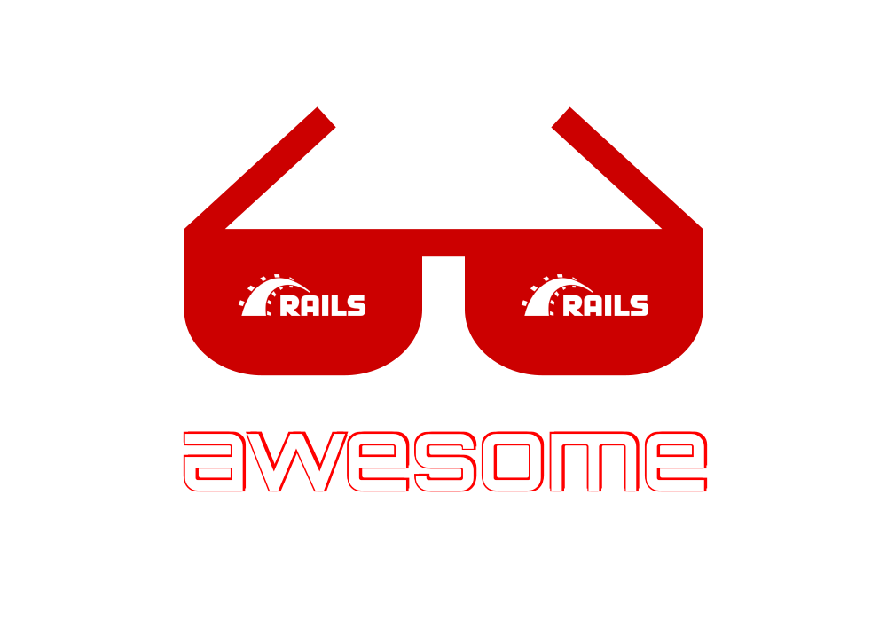

# Awesome Rails

> A curated list of awesome things related to Ruby on Rails 

## Table of Contents

Use the "Table on Contents" menu on the top-left corner to explore the list.

## Resources

### Official Resources

- [Rails Official Website](https://rubyonrails.org)
- [Rails Official Guide](https://guides.rubyonrails.org)
- [Rails Official Guide (Edge Guide)](https://edgeguides.rubyonrails.org)
- [Rails API Documentation](https://api.rubyonrails.org)
- [Rails Source Code][link_rails_source]
- [Rails Official Blog](https://weblog.rubyonrails.org)

[Back to top][link_toc]

### External Resources

#### Books

- [Ruby on Rails Tutorial Book](https://www.railstutorial.org/book)
- [Agile Web Development with Rails 6](https://pragprog.com/titles/rails6/agile-web-development-with-rails-6/)
- [Docker for Rails Developers](https://pragprog.com/titles/ridocker/docker-for-rails-developers/)
- [Rails 5 Test Prescriptions](https://pragprog.com/titles/nrtest3/rails-5-test-prescriptions/)
- [Rails, Angular, Postgres, and Bootstrap, Second Edition](https://pragprog.com/titles/dcbang2/rails-angular-postgres-and-bootstrap-second-edition/)
- [Growing Rails Applications in Practice](https://pragprog.com/titles/d-kegrap/growing-rails-applications-in-practice/)
- [Crafting Rails 4 Applications](https://pragprog.com/titles/jvrails2/crafting-rails-4-applications/)
- [The Rails 6 Way](https://leanpub.com/therails6way)

#### Video tutorials

- [RailsCasts](http://railscasts.com) *(inactive since 2013)
- [GoRails](https://gorails.com) *(freemium)
- [Drifting Ruby](https://www.driftingruby.com/) *(freemium)

#### Youtube channels

- [DriftingRuby](https://www.youtube.com/c/DriftingRuby/videos)
- [Gorails](https://www.youtube.com/c/GorailsTV/videos)
- [TechmakerTV](https://www.youtube.com/c/TechmakerTV/videos)
- [Deanin](https://www.youtube.com/c/Deanin/videos)
- [Webcrunch](https://www.youtube.com/c/Webcrunch/videos)

#### Other external resources

- [The Odin Project](https://www.theodinproject.com/courses/ruby-on-rails)
- [Learn Ruby on Rails (thoughtbot)](https://thoughtbot.com/upcase/rails)
- [Ruby on Windows Guides](http://rubyonwindowsguides.github.io)

[Back to top][link_toc]

### Jobs

- [Stack Overflow](https://stackoverflow.com/jobs/developer-jobs-using-ruby-on-rails)
- [railsjobs on Reddit](https://www.reddit.com/r/railsjobs/)
- [rails jobs on indeed.com](https://www.indeed.com/q-Ruby-On-Rails-jobs.html)
- [rails jobs on glassdoor.com](https://www.glassdoor.com/Job/ruby-on-rails-developer-jobs-SRCH_KO0,23.htm)
- [rails jobs on gorails.com](https://jobs.gorails.com)
- [rails jobs on remoteok.io](https://remoteok.io/remote-ruby-on-rails-jobs)
- [rails jobs on weworkremotely.com](https://weworkremotely.com/remote-ruby-on-rails-jobs)
- [reverse job board for rails devs - railsdevs.com](https://railsdevs.com)

> Tip: You can find list of remote job boards including Rails jobs on [awesome-remote-job](https://github.com/lukasz-madon/awesome-remote-job#job-boards)

[Back to top][link_toc]

### Community

- [rails on Twitter](https://twitter.com/rails)
- [rails on Reddit](https://www.reddit.com/r/rails/)
- [Ruby on Rails Discussions](https://discuss.rubyonrails.org/)
- [Gorails forum](https://gorails.com/forum)

[Back to top][link_toc]

### Articles

> from dev.to:

- [More than "Hello World" in Docker: Build Rails + Sidekiq web apps in Docker](https://dev.to/raphael_jambalos/more-than-hello-world-in-docker-run-rails-sidekiq-web-apps-in-docker-1b37)
- [Design Patterns with Ruby on Rails part 1: Introduction and Policy Object](https://dev.to/renatamarques97/design-patterns-with-ruby-on-rails-part-1-introduction-and-policy-object-1c37) - [Part 2](https://dev.to/renatamarques97/design-patterns-with-ruby-on-rails-part-2-query-object-1h65)
- [The Progressive Rails App](https://dev.to/coorasse/the-progressive-rails-app-46ma)
- [Modern Rails flash messages (part 1): ViewComponent, Stimulus & Tailwind CSS](https://dev.to/citronak/modern-rails-flash-messages-part-1-viewcomponent-stimulus-tailwind-css-3alm) - [Part 2](https://dev.to/citronak/modern-rails-flash-messages-part-2-the-undo-action-for-deleted-items-2a50)
- [Building a Rails App With Multiple Subdomains](https://dev.to/appsignal/building-a-rails-app-with-multiple-subdomains-g05)
- [Reactive Rails applications with StimulusReflex](https://dev.to/finiam/reactive-rails-applications-with-stimulusreflex-48kn)
- [1 Backend, 5 Frontends - Todo List with Rails, React, Angular, Vue, Svelte, and jQuery](https://dev.to/alexmercedcoder/1-backend-5-frontends-todo-list-with-rails-react-angular-vue-svelte-and-jquery-18kp)
- [Create a Video Party App With Rails Part 1: Building the Backend](https://dev.to/vonagedev/create-a-video-party-app-with-rails-part-1-building-the-backend-2p4k) - [Part 2](https://dev.to/vonagedev/create-a-video-party-app-with-rails-part-2-building-the-frontend-hfe)
- [The Rails Model Introduction I Wish I Had](https://dev.to/maxwell_dev/the-rails-model-introduction-i-wish-i-had-5h2d)
- [How to create a gem in Ruby on Rails? -From Scratch-](https://dev.to/solutelabs/how-to-create-a-gem-in-ruby-on-rails-fromscratch-3f4p)
- [Multiple Foreign Keys for the Same Relationship in Rails 6](https://dev.to/luchiago/multiple-foreign-keys-for-the-same-model-in-rails-6-7ml)
- [QR Code Reader on Rails](https://dev.to/morinoko/qr-code-reader-on-rails-5816)
- [Magic Links with Ruby On Rails and Devise](https://dev.to/matiascarpintini/magic-links-with-ruby-on-rails-and-devise-4e3o)
- [I created the same application with Rails and no JavaScript](https://dev.to/mario_chavez/i-created-the-same-application-with-rails-and-no-javascript-288o)
- [Instantly speed up your Rails application by self-hosting your fonts](https://dev.to/andrewmcodes/instantly-speed-up-your-rails-application-by-self-hosting-your-fonts-526d)
- [Reactive Map with Rails, Stimulus Reflex and Mapbox](https://dev.to/ilrock__/reactive-map-with-rails-stimulus-reflex-and-mapbox-1po4)
- [A Future for Rails: StimulusReflex](https://dev.to/drews256/a-future-for-rails-stimulusreflex-48kb)
- [Introduction to Ruby on Rails Patterns and Anti-patterns Part 1](https://dev.to/appsignal/introduction-to-ruby-on-rails-patterns-and-anti-patterns-2mhc) - [Part 2](https://dev.to/appsignal/ruby-on-rails-model-patterns-and-anti-patterns-32k9)
- [Rails Concerns: To Concern Or Not To Concern](https://dev.to/appsignal/rails-concerns-to-concern-or-not-to-concern-3n94)
- [Building an Event Sourcing System in Rails, Part 1: What is Event Sourcing?](https://dev.to/isalevine/building-an-event-sourcing-system-in-rails-part-1-what-is-event-sourcing-46db) - [Part 2](https://dev.to/isalevine/building-an-event-sourcing-pattern-in-rails-from-scratch-355h)
- [Real Time Notification System with Sidekiq, Redis and Devise in Rails 6](https://dev.to/matiascarpintini/real-time-notification-system-with-sidekiq-redis-and-devise-in-rails-6-33l9)
- [Deploying Your Rails 6 App](https://dev.to/render/deploying-your-rails-6-app-4an4)
- [What's Cooking in Rails 7?](https://dev.to/hint/what-s-cooking-in-rails-7-a42)
- [Using Hotwire Turbo in Rails with legacy JavaScript](https://dev.to/nejremeslnici/using-hotwire-turbo-in-rails-with-legacy-javascript-17g1)
- [From Rails scaffold listing to Hotwire infinite scroll](https://dev.to/andrzejkrzywda/from-rails-scaffold-listing-to-hotwire-infinite-scroll-3273)
- [Building a Component Library in Rails With Storybook](https://dev.to/orbit/building-a-component-library-in-rails-with-storybook-49m4)
- [How to Speed Up Load Times In A Rails App - What I Wish I Knew Four Months Ago](https://dev.to/nicklevenson/how-to-speed-up-load-times-in-a-rails-app-what-i-wish-i-knew-four-months-ago-28g0)
- [Endless Scroll / Infinite Loading with Turbo Streams & Stimulus](https://dev.to/zealot128/endless-scroll-infinite-loading-with-turbo-streams-stimulus-5d89)

> from shopify.engineering:

- [How to Write Fast Code in Ruby on Rails](https://shopify.engineering/write-fast-code-ruby-rails)
- [How to Introduce Composite Primary Keys in Rails](https://shopify.engineering/how-to-introduce-composite-primary-keys-in-rails)
- [Enforcing Modularity in Rails Apps with Packwerk](https://shopify.engineering/enforcing-modularity-rails-apps-packwerk)

> from blog.planetargon.com:

- [8 Useful Ruby on Rails Gems We Couldn't Live Without](https://blog.planetargon.com/entries/8-useful-ruby-on-rails-gems-we-couldnt-live-without)
- [Ruby on Rails Code Audits: 8 Steps to Review Your App](https://blog.planetargon.com/entries/ruby-on-rails-code-audits-8-steps-to-review-your-app)
- [Rails 6.1 is Out! How to Prepare Your App Now](https://blog.planetargon.com/entries/rails-61-is-coming-soon-how-to-prepare-your-app-now)
- [When Should You Upgrade Your Rails Application?](https://blog.planetargon.com/entries/when-should-you-upgrade-your-rails-application)
- [Helpful Resources for Upgrading Your Rails App Version](https://blog.planetargon.com/entries/helpful-resources-for-your-rails-upgrade)
- [Upgrading Rails: Interview with Eileen Uchitelle](https://blog.planetargon.com/entries/upgrading-rails-an-interview-with-eileen-uchitelle)

> from blog.arkency.com:

- [nil?, empty?, blank? in Ruby on Rails - what's the difference actually?](https://blog.arkency.com/2017/07/nil-empty-blank-ruby-rails-difference/)
- [How well Rails developers actually test their apps](https://blog.arkency.com/how-well-rails-developers-actually-test-their-apps/)
- [Rails multitenancy story in 11 snippets of code](https://blog.arkency.com/rails-multitenancy-story-in-11-snippets-of-code/)
- [Painless Rails upgrades](https://blog.arkency.com/painless-rails-upgrades/)
- [Comparison of approaches to multitenancy in Rails apps](https://blog.arkency.com/comparison-of-approaches-to-multitenancy-in-rails-apps/)
- [Managing Rails Event Store Subscriptions — How To](https://blog.arkency.com/managing-rails-event-store-subscriptions-how-to/)
- [Rails connections, pools and handlers](https://blog.arkency.com/rails-connections-pools-and-handlers/)
- [How to balance the public APIs of an open-source library — practical examples from RailsEventStore](https://blog.arkency.com/how-to-balance-the-public-apis-of-open-source-library-practical-examples-from-railseventstore/)
- [Rack apps mounted in Rails — how to protect access to them?](https://blog.arkency.com/common-authentication-for-mounted-rack-apps-in-rails/)

> from scotch.io:

- [File Upload in Rails with PaperClip](https://scotch.io/tutorials/file-upload-in-rails-with-paperclip)
- [Build a Blog with Ruby on Rails](https://scotch.io/tutorials/build-a-blog-with-ruby-on-rails-part-1) - [Part 2](https://scotch.io/tutorials/build-a-blog-with-ruby-on-rails-part-2)
- [Uploading Files With Rails and ActionCable](https://scotch.io/tutorials/uploading-files-with-rails-and-actioncable)
- [Create an Online Streaming Radio With Rails and Icecast](https://scotch.io/tutorials/creating-online-streaming-radio-with-rails-and-icecast)
- [Integrating Social Login in a Ruby on Rails Application](https://scotch.io/tutorials/integrating-social-login-in-a-ruby-on-rails-application)
- [Asynchronous Chat With Rails and ActionCable](https://scotch.io/tutorials/asynchronous-chat-with-rails-and-actioncable)

> from sitepoint.com:

- [10 Ruby on Rails Best Practices](https://www.sitepoint.com/10-ruby-on-rails-best-practices-3/)
- [Building APIs with Ruby on Rails and GraphQL](https://www.sitepoint.com/building-apis-ruby-rails-graphql/)
- [Understanding the Model-View-Controller (MVC) Architecture in Rails](https://www.sitepoint.com/model-view-controller-mvc-architecture-rails/)
- [Beyond Rails Abstractions: A Dive into Database Internals](https://www.sitepoint.com/beyond-rails-abstractions-dive-database-internals/)
- [Search and Autocomplete in Rails Apps](https://www.sitepoint.com/search-autocomplete-rails-apps/)
- [Start Your SEO Right with Sitemaps on Rails](https://www.sitepoint.com/start-your-seo-right-with-sitemaps-on-rails/)
- [Handle Password and Email Changes in Your Rails API](https://www.sitepoint.com/handle-password-and-email-changes-in-your-rails-api/)
- [Master Many-to-Many Associations with ActiveRecord](https://www.sitepoint.com/master-many-to-many-associations-with-activerecord/)
- [Common Rails Security Pitfalls and Their Solutions](https://www.sitepoint.com/common-rails-security-pitfalls-and-their-solutions/)

> from pganalyze.com:

- [Efficient GraphQL queries in Ruby on Rails & Postgres](https://pganalyze.com/blog/efficient-graphql-queries-in-ruby-on-rails-and-postgres)
- [Similarity in Postgres and Rails using Trigrams](https://pganalyze.com/blog/similarity-in-postgres-and-ruby-on-rails-using-trigrams)
- [Effectively Using Materialized Views in Ruby on Rails](https://pganalyze.com/blog/materialized-views-ruby-rails)
- [Full Text Search in Milliseconds with Rails and PostgreSQL](https://pganalyze.com/blog/full-text-search-ruby-rails-postgres)
- [Advanced Active Record: Using Subqueries in Rails](https://pganalyze.com/blog/active-record-subqueries-rails)
- [PostGIS vs. Geocoder in Rails](https://pganalyze.com/blog/postgis-rails-geocoder)
- [Creating Custom Postgres Data Types in Rails](https://pganalyze.com/blog/custom-postgres-data-types-ruby-rails)

> from semaphoreci.com:

- [Integration Testing Ruby on Rails with Minitest and Capybara](https://semaphoreci.com/community/tutorials/integration-testing-ruby-on-rails-with-minitest-and-capybara)
- [Mocking in Ruby with Minitest](https://semaphoreci.com/community/tutorials/mocking-in-ruby-with-minitest)
- [How to Test Rails Models with RSpec](https://semaphoreci.com/community/tutorials/how-to-test-rails-models-with-rspec)
- [Dockerizing a Ruby on Rails Application](https://semaphoreci.com/community/tutorials/dockerizing-a-ruby-on-rails-application)

> from evilmartians.com:

- [Dockerizing Ruby and Rails development](https://evilmartians.com/chronicles/ruby-on-whales-docker-for-ruby-rails-development)
- [How to GraphQL with Ruby, Rails, Active Record, and no N+1](https://evilmartians.com/chronicles/how-to-graphql-with-ruby-rails-active-record-and-no-n-plus-one)
- [Keep up with the Tines: Rails frontend revamp](https://evilmartians.com/chronicles/keep-up-with-the-tines-a-rails-frontend-revamp)
- [Pulling the trigger: How to update counter caches in your Rails app without Active Record callbacks](https://evilmartians.com/chronicles/pulling-the-trigger-how-to-update-counter-caches-in-you-rails-app-without-active-record-callbacks)
- [GraphQL on Rails: On the way to perfection](https://evilmartians.com/chronicles/graphql-on-rails-3-on-the-way-to-perfection)
- [Danger on Rails: make robots do some code review for you!](https://evilmartians.com/chronicles/danger-on-rails-make-robots-do-some-code-review-for-you)
- [GraphQL on Rails: From zero to the first query](https://evilmartians.com/chronicles/graphql-on-rails-1-from-zero-to-the-first-query)
- [A fixture-based approach to interface testing in Rails](https://evilmartians.com/chronicles/a-fixture-based-approach-to-interface-testing-in-rails)

> from digitalocean.com:

- [How To Add Stimulus to a Ruby on Rails Application](https://www.digitalocean.com/community/tutorials/how-to-add-stimulus-to-a-ruby-on-rails-application)
- [Build a RESTful JSON API With Rails 5](https://www.digitalocean.com/community/tutorials/build-a-restful-json-api-with-rails-5-part-one)

> from cloud66.com:

- [Making Hotwire and Devise play nicely](https://blog.cloud66.com/making-hotwire-and-devise-play-nicely-with-viewcomponents/)
- [Taking Rails to the next level with Hotwire](https://blog.cloud66.com/taking-rails-to-the-next-level-with-hotwire/)
- [Hotwire, ViewComponents and TailwindCSS: The Ultimate Rails Stack](https://blog.cloud66.com/hotwire-viewcomponents-and-tailwindcss-the-ultimate-rails-stack/)
- [Adding Super Fast Frontend Search in Rails with Lunr](https://blog.cloud66.com/adding-super-fast-frontend-search-in-rails-with-lunr/)

> from not yet classified sources:

- [Protecting your users data from Rails application using cryptography](https://github.com/cossacklabs/acra/wiki/Using-Acra-to-Protect-Your-Rails-App)
- [The 3 Tenets of Service Objects in Ruby on Rails](https://hackernoon.com/the-3-tenets-of-service-objects-c936b891b3c2)
- [Famous Web Apps Built with Ruby on Rails](https://railsware.com/blog/famous-web-apps-built-with-ruby-on-rails/)
- [Building a JSON API with Rails 5](https://www.cloudbees.com/blog/building-a-json-api-with-rails-5)
- [Five Practices for Robust Ruby on Rails Applications](https://www.cloudbees.com/blog/five-practices-for-robust-ruby-on-rails-applications/)
- [Crafting APIs With Rails](https://code.tutsplus.com/articles/crafting-apis-with-rails--cms-27695)
- [Working with the SQL ‘time’ type in Ruby on Rails](https://engineering.ezcater.com/youre-not-in-the-zone)
- [Upgrading Rails apps with dual boot](https://medium.com/oreilly-engineering/upgrading-rails-apps-with-dual-boot-e5c271e68a6e)
- [What Are Rails Parameters & How to Use Them Correctly](https://www.rubyguides.com/2019/06/rails-params/)
- [How to Remove Single Table Inheritance from Your Rails Monolith](https://medium.com/flatiron-labs/how-to-remove-single-table-inheritance-from-your-rails-monolith-c6009239defb)
- [Build a Rails application with VueJS using JSX](https://nebulab.it/blog/build-rails-application-vuejs-using-jsx/)
- [Fetching millions of rows from PostgreSQL with Rails](https://blog.magrathealabs.com/fetching-millions-of-rows-from-postgresql-with-rails-70c0cec1b6f5)
- [Implementing Multi-Table Full Text Search with Postgres in Rails](https://thoughtbot.com/blog/implementing-multi-table-full-text-search-with-postgres)
- [Ruby on Rails ActiveRecord PostgreSQL Data Integrity and Validations](https://pawelurbanek.com/rails-postgresql-data-integrity)
- [Programming Community Curated Resources For Learning Ruby on Rails](https://hackr.io/tutorials/learn-ruby-on-rails)
- [Choosing ruby on rails for your next web development project (business guide)](https://www.ideamotive.co/ruby-on-rails/guide)
- [Dockerizing a Rails application](https://iridakos.com/tutorials/2019/04/07/dockerizing-a-rails-application.html)
- [How to painlessly set up your Ruby on Rails dev environment with Docker](https://www.freecodecamp.org/news/painless-rails-development-environment-setup-with-docker/)
- [How I used Docker with Rails](https://admatbandara.medium.com/how-i-used-docker-with-rails-45601c43ed8f)
- [Rails 6 Features: What's New and Why It Matters](https://www.toptal.com/ruby-on-rails/rails-6-features)
- [Ruby on Rails configuration tutorials](https://hixonrails.com/ruby-on-rails-tutorials/)
- [Containerizing Ruby on Rails Applications](https://technology.doximity.com/articles/containerizing-ruby-on-rails-applications)
- [Behind The Scenes: Rails UJS](https://www.ombulabs.com/blog/learning/javascript/behind-the-scenes-rails-ujs.html)
- 

[Back to top][link_toc]

## Open Source Rails Apps

> Note: Rails versions of these apps are valid as the date of latest commit. They are defined in their Gemfile and/or Gemfile.lock and they might be outdated. If you find it outdated, don't forget to notfiy us by opening a pull request.

- [activeWorkflow](https://github.com/automaticmode/active_workflow) - An intelligent process and workflow automation platform based on software agents (using Rails 5.2).
- [adopt-a-hydrant](https://github.com/codeforamerica/adopt-a-hydrant) - A civic infrastructure detection app (using Rails 4.2).
- [airCasting](https://github.com/HabitatMap/AirCasting) - A platform for recording, mapping, and sharing health and environmental data using your smartphone (using Rails 5.2). - [:earth_africa:](https://www.habitatmap.org/aircasting)
- [alaveteli](https://github.com/mysociety/alaveteli) - A platform for making public freedom of information requests - using Rails 5.1 - [:earth_africa:](https://alaveteli.org)
- [alonetone](https://github.com/sudara/alonetone) - A music hosting, management & distribution app (using Rails 6.0). - [:earth_africa:](https://alonetone.com)
- [api.rss](https://github.com/davidesantangelo/api.rss) - A RSS feed conversion (to API) app (using Rails 5.2).
- [asakusaSatellite](https://github.com/codefirst/AsakusaSatellite) - A realtime chat application for developers (using Rails 6.0). - [:earth_africa:](https://www.codefirst.org/AsakusaSatellite/)
- [askaway](https://github.com/askaway/askaway) - Question & answer app specialized in politics (using Rails 4.1).
- [autolab](https://github.com/autolab/Autolab) - A course management app (using Rails 4.2). - [:earth_africa:](https://autolabproject.com/)
- [beatstream](https://github.com/Darep/Beatstream) -  A music streaming app - using Rails 3.2
- [bike_index](https://github.com/bikeindex/bike_index) - A bike registry tracking app (using Rails 4.2). - [:earth_africa:](https://bikeindex.org)
- [blackCandy](https://github.com/aidewoode/black_candy) - A music streaming app (using Rails 6.0).
- [brimir](https://github.com/ivaldi/brimir) - An email helpdesk app (using Rails 5.2). (archived).
- [calagator](https://github.com/calagator/calagator) - A community calendaring app (using Rails 4.2).
- [campo](https://github.com/chloerei/campo) - A forum app (using Rails 4.2). - [:earth_africa:](https://codecampo.com/)
- [canvas-lms](https://github.com/instructure/canvas-lms) - A learning management app (using Rails 5.2).
- [catarse](https://github.com/catarse/catarse) - A crowdfunding platform for creative projects (using Rails 4.2). - [:earth_africa:](https://www.catarse.me/)
- [chatwoot](https://github.com/chatwoot/chatwoot) - A simple and elegant live chat software (using Rails 6.0).
- [ciao](https://github.com/brotandgames/ciao) - A URL status checking app (using Rails 6.0).
- [coRM](https://github.com/SIGIRE/CoRM) - A customer relationship management app - using Rails 3.2 - [:earth_africa:](http://www.corm.fr)
- [coderwall (legacy)](https://github.com/coderwall/coderwall-legacy) - A social network app for software engineers - using Rails 3.2
- [coderwall (next)](https://github.com/coderwall/coderwall-next) - A social network app for software engineers - using Rails 5.0
- [codetriage](https://github.com/codetriage/codetriage) - An open source project finder app (using Rails 6.0). - [:earth_africa:](https://www.codetriage.com/)
- [commudle](https://github.com/commudle/commudle) - A community management app (using Rails 5.2).
- [contribulator](https://github.com/24pullrequests/contribulator) - An open source project finder app - using Rails 5.1
- [coursemology2](https://github.com/Coursemology/coursemology2) - Learning platform app (using Rails 5.2).
- [covoiturage-libre](https://github.com/covoiturage-libre/covoiturage-libre) - A carpooling app - using Rails 5.0 (archived).
- [crabgrass-core](https://0xacab.org/liberate/crabgrass) - A collaboration platform for activist groups (using Rails 4.2).
- [crowdAI](https://github.com/crowdAI/crowdai) - An app for data science challenges (using Rails 5.2). - [:earth_africa:](https://www.crowdai.org/)
- [crowdtiltOpen](https://github.com/Crowdtilt/CrowdtiltOpen) - A crowdfunding platform - using Rails 3.2
- [cw-ovp](https://github.com/x1wins/CW-OVP) - video packaging to *.m3u8 for HLS (HTTP Live Streaming) with FFMPEG on website (using Rails 6.0).
- [danbooru](https://github.com/danbooru/danbooru) - A taggable image board app (using Rails 6.0).
- [dcaf_case_management](https://github.com/DCAFEngineering/dcaf_case_management) - A case management app (using Rails 5.2).
- [dgidb](https://github.com/dgidb/dgidb) - A drug gene interaction platform - using Rails 5.1
- [diaper](https://github.com/rubyforgood/diaper) - An inventory management app for diaper banks (using Rails 6.0). - [:earth_africa:](https://diaper.app/)
- [diaspora](https://github.com/diaspora/diaspora) - A social networking app - using Rails 5.1 - [:earth_africa:](https://diasporafoundation.org)
- [discourse](https://github.com/discourse/discourse) - A platform for community discussion (using Rails 6.0). - [:earth_africa:](https://try.discourse.org/)
- [ekylibre](https://github.com/ekylibre/ekylibre) - A farm management app (using Rails 4.2).
- [postal](https://github.com/postalhq/postal) - A mail delivery platform (using Rails 5.2).
- [encrypt.to](https://github.com/encrypt-to/encrypt.to) - A messaging app with encryption support (using Rails 4.2).
- [eol](https://github.com/EOL/eol) - An encyclopedia app - using Rails 3.2 - [:earth_africa:](https://eol.org/)
- [expertiza](https://github.com/expertiza/expertiza) - A learning material sharing app (using Rails 4.2).
- [FAE](https://github.com/wearefine/fae/) - A modern CMS deveveloped by FINE (using Rails 5.2)
- [fairmondo](https://github.com/fairmondo/fairmondo) - A marketplace app (using Rails 4.2). - [:earth_africa:](https://www.fairmondo.de)
- [fat-free-crm](https://github.com/fatfreecrm/fat_free_crm) - An open source, Ruby on Rails customer relationship management platform (CRM) (using Rails 5.2). - [:earth_africa:](http://www.fatfreecrm.com/)
- [feedbin](https://github.com/feedbin/feedbin) -  A RSS reader app (using Rails 6.0). - [:earth_africa:](https://feedbin.com)
- [follow-all](https://github.com/codeforamerica/follow-all) - A Twitter account management app (using Rails 4.2). (archived).
- [forem](https://github.com/forem/forem) - Social platform app specialized for web development (using Rails 5.2). - [:earth_africa:](https://www.forem.com)
- [fromthepage](https://github.com/benwbrum/fromthepage) - A wiki-like app for crowdsourcing transcription of handwritten documents (using Rails 4.1). - [:earth_africa:](https://www.fromthepage.com/)
- [gitlabhq](https://github.com/gitlabhq/gitlabhq) -  A code collaboration app (using Rails 6.0).
- [graff_mags](https://github.com/dankleiman/graff_mags) - A graffiti magazine sharing app (using Rails 4.1). - [:earth_africa:](http://graffmags.herokuapp.com)
- [growstuff](https://github.com/Growstuff/growstuff) -  A data management app for food gardeners (using Rails 5.2). - [:earth_africa:](https://www.growstuff.org/)
- [hackershare](https://github.com/hackershare/hackershare) - Social bookmarks website for hackers (using Rails 6.0). - [:earth_africa:](https://hackershare.dev/en)
- [hashrobot](https://github.com/rysmith/hashrobot) - A social media management app (using Rails 4.2). - [:earth_africa:](http://www.hashrobot.com)
- [helpy](https://github.com/helpyio/helpy) - A customer support app (using Rails 4.2). - [:earth_africa:](https://helpy.io/)
- [hitobito](https://github.com/hitobito/hitobito) - An event organization app (using Rails 4.2). - [:earth_africa:](https://hitobito.com/en)
- [hours](https://github.com/defactosoftware/hours) - A time tracking app (using Rails 4.2). - [:earth_africa:](https://happyhours.io)
- [inaturalist](https://github.com/inaturalist/inaturalist) -  A community app for nature and related stuff (using Rails 4.2). - [:earth_africa:](https://www.inaturalist.org)
- [intercityup.com](https://github.com/intercity/intercity-next) - A control panel app for app deployment (using Rails 4.1).
- [kanban](https://github.com/seanomlor/kanban) - A Trello clone (using Rails 4.2).
- [kitsu-tools](https://github.com/hummingbird-me/kitsu-tools) - An anime discovery platform (using Rails 4.1).
- [lavish](https://github.com/mquan/lavish) - A color scheme generator (using Rails 4.2).
- [lifeToRemind](https://github.com/eduqg/LifeToRemind) - A career planning app (using Rails 5.2).
- [lobsters](https://github.com/lobsters/lobsters) - A link aggregation app (using Rails 5.2). - [:earth_africa:](https://lobste.rs)
- [loomio](https://github.com/loomio/loomio) -  A collaborative decision-making app (using Rails 5.2). - [:earth_africa:](https://www.loomio.org)
- [mastodon](https://github.com/tootsuite/mastodon) - A microblogging app (using Rails 5.2). - [:earth_africa:](https://mastodon.social/about)
- [obtvse2](https://github.com/natew/obtvse2) - A blogging app (using Rails 4.0).
- [onebody](https://github.com/seven1m/onebody) - A social networking app for churches - using Rails 5.1
- [openFarm](https://github.com/openfarmcc/OpenFarm) -  A database for information about farming and gardening (using Rails 5.2). -
- [opencongress](https://github.com/sunlightlabs/opencongress) - A website for getting information about US Congress - using Rails 3.0 (archived).
- [openproject](https://github.com/opf/openproject) - A project management app (using Rails 6.0). - [:earth_africa:](https://www.openproject.org)
- [openstreetmap-website](https://github.com/openstreetmap/openstreetmap-website) - A map viewing app (using Rails 6.0). -  [:earth_africa:](https://www.openstreetmap.org)
- [opensourcefriday](https://github.com/github/opensourcefriday) - A project contribution tracking app (using Rails 6.0). - [:earth_africa:](https://opensourcefriday.com)
- [otwarchive](https://github.com/otwcode/otwarchive) -  A social networking app for fans - using Rails 5.1 - [:earth_africa:](https://archiveofourown.org)
- [passwordPusher](https://github.com/pglombardo/PasswordPusher) - A password delivery app (using Rails 4.2). - [:earth_africa:](https://pwpush.com)
- [peatio](https://github.com/peatio/peatio) - A crypto currency exchange app (using Rails 4.0).
- [planningalerts-app](https://github.com/openaustralia/planningalerts) - A planned applications tracking app (using Rails 5.2). - [:earth_africa:](https://www.planningalerts.org.au)
- [popHealth](https://github.com/pophealth/popHealth) -  A population health reporting app (using Rails 4.1).
- [publify](https://github.com/publify/publify) - A blogging app (using Rails 5.2).
- [quant](https://github.com/jdjkelly/quant) -  A personal health tracker (using Rails 4.1).
- [racing_on_rails](https://github.com/scottwillson/racing_on_rails) - A bike racing organization app (using Rails 5.2).
- [rapidFTR](https://github.com/rapidftr/RapidFTR) -  An information provider app for aid workers (using Rails 4.0).
- [redmine](https://github.com/edavis10/redmine) - A project management app (using Rails 5.2). - [:earth_africa:](http://demo.redmine.org)
- [rentmybikes-rails](https://github.com/balanced/rentmybikes-rails) - A marketplace app - (using Rails 4.0).
- [reservations](https://github.com/YaleSTC/reservations) - An inventory management app (using Rails 6.0). - [:earth_africa:](http://yalestc.github.io/reservations/)
- [rletters](https://codeberg.org/rletters/rletters) - A frontend for database of journal articles for researchers (using Rails 6.0). - [:earth_africa:](https://www.rletters.net)
- [rubygems.org](https://github.com/rubygems/rubygems.org) - A gem hosting platform (using Rails 6.0). - [:earth_africa:](https://rubygems.org)
- [sanataro](https://github.com/kaznum/sanataro) - An account tracker (using Rails 4.2).
- [scholarsphere](https://github.com/psu-stewardship/scholarsphere) - A digital assets management app - using Rails 5.1
- [selfstarter](https://github.com/apigy/selfstarter) - A crowdfunding app (using Rails 4.0).
- [sharetribe](https://github.com/sharetribe/sharetribe) - A peer-to-peer marketplace platform (using Rails 5.2). - [:earth_africa:](https://www.sharetribe.com)
- [socify](https://github.com/scaffeinate/socify) - A social networking platform - using Rails 5.0
- [splits-io](https://github.com/glacials/splits-io) - A speedrun data store and analysis engine. (using Rails 6.0). - [:earth_africa:](https://splits.io)
- [spokenvote](https://github.com/Spokenvote/spokenvote) - A social voting app (using Rails 4.2).
- [stackneveroverflow](https://github.com/liaoziyang/stackneveroverflow) - A question asking & answering platform - using Rails 5.0
- [teambox](https://github.com/redbooth/teambox) - A collaboration app - using Rails 3.0 - [:earth_africa:](https://redbooth.com) (archived).
- [theodinproject](https://github.com/TheOdinProject/theodinproject) - A teaching & learning platform (using Rails 5.2). - [:earth_africa:](https://www.theodinproject.com/)
- [tracks](https://github.com/TracksApp/tracks) - A goal tracking app (using Rails 5.2). - [:earth_africa:](https://www.getontracks.org)
- [trado](https://github.com/Jellyfishboy/trado) - An e-commerce platform (using Rails 4.2).
- [vglist](https://github.com/connorshea/vglist) - A video game library tracking web app (using Rails 6.0). - [:earth_africa:](https://vglist.co/)
- [websiteOne](https://github.com/AgileVentures/WebsiteOne) - A project tracking app (using Rails 5.2). - [:earth_africa:](https://www.agileventures.org/)
- [whitehall](https://github.com/alphagov/whitehall) - A content management app used by UK government - using Rails 5.1

[Back to top][link_toc]

## Gems

> [:red_circle:] : RubyGems link of gems

- [rails][link_rails_source] - A full-stack web development framework [:red_circle:](https://rubygems.org/gems/rails)

> Direct dependencies of the "rails" gem:

- [actioncable](https://github.com/rails/rails/tree/main/actioncable) - A gem to integrate websocket with a Rails app [:red_circle:](https://rubygems.org/gems/actioncable) - [Action Cable Overview](https://guides.rubyonrails.org/action_cable_overview.html)
- [actionmailbox](https://github.com/rails/rails/tree/main/actionmailbox) - A gem to handle incoming emails within a Rails app [:red_circle:](https://rubygems.org/gems/actionmailbox) - [Action Mailbox Basics](https://guides.rubyonrails.org/action_mailbox_basics.html)
- [actionmailer](https://github.com/rails/rails/tree/main/actionmailer) - A gem to compose, deliver & test emails within a Rails app [:red_circle:](https://rubygems.org/gems/actionmailer) - [Action Mailer Basics](https://guides.rubyonrails.org/action_mailer_basics.html)
- [actionpack](https://github.com/rails/rails/tree/main/actionpack) - A gem to manage requests & responses within a Rails app [:red_circle:](https://rubygems.org/gems/actionpack)
- [actiontext](https://github.com/rails/rails/tree/main/actiontext) - A gem to integrate rich text editor into a Rails app [:red_circle:](https://rubygems.org/gems/actiontext) - [Action Text Overview](https://guides.rubyonrails.org/action_text_overview.html)
- [actionview](https://github.com/rails/rails/tree/main/actionview) - A gem to handle view templates within a Rails app [:red_circle:](https://rubygems.org/gems/actionview) - [Action View Overview](https://guides.rubyonrails.org/action_view_overview.html)
- [activejob](https://github.com/rails/rails/tree/main/activejob) - A gem to handle background jobs within a Rails app [:red_circle:](https://rubygems.org/gems/activejob) - [Active Job Basics](https://guides.rubyonrails.org/active_job_basics.html)
- [activemodel](https://github.com/rails/rails/tree/main/activemodel) - A gem to define a set of interfaces to use in model classes within a Rails app [:red_circle:](https://rubygems.org/gems/activemodel) - [Active Model Basics](https://guides.rubyonrails.org/active_model_basics.html)
- [activerecord](https://github.com/rails/rails/tree/main/activerecord) - A gem to connect model classes with relational databases within a Rails app [:red_circle:](https://rubygems.org/gems/activerecord) - [Active Record Basics](https://guides.rubyonrails.org/active_record_basics.html)
- [activestorage](https://github.com/rails/rails/tree/main/activestorage) - A gem to handle file uploads to cloud storage providers within a Rails app [:red_circle:](https://rubygems.org/gems/activestorage) - [Active Storage Overview](https://guides.rubyonrails.org/active_storage_overview.html)
- [activesupport](https://github.com/rails/rails/tree/main/activesupport) - A gem to provide some extensions to support a Rails app [:red_circle:](https://rubygems.org/gems/activesupport) - [Active Support Core Extensions](https://guides.rubyonrails.org/active_support_core_extensions.html)
- [railties](https://github.com/rails/rails/tree/main/railties) - A gem to handle gems & engines used in a Rails app to work together [:red_circle:](https://rubygems.org/gems/railties)

> Other gems that can be used with Rails

- [ace-rails-ap](https://github.com/codykrieger/ace-rails-ap) - A gem to integrate ajax.org cloud9 editor into Rails asset pipeline. [:red_circle:](https://rubygems.org/gems/ace-rails-ap)
- [action_policy](https://github.com/palkan/action_policy) - A tool to handle authorization. [:red_circle:](https://rubygems.org/gems/action_policy)
- [active_decorator](https://github.com/amatsuda/active_decorator) - A gem to keep views & helpers object-oriented. [:red_circle:](https://rubygems.org/gems/active_decorator)
- [active_enum](https://github.com/adzap/active_enum) - A gem to provide enum classes [:red_circle:](https://rubygems.org/gems/active_enum)
- [activeadmin](https://github.com/activeadmin/activeadmin) - A gem to provide admin panel. [:red_circle:](https://rubygems.org/gems/activeadmin)
- [activerecord-analyze](https://github.com/pawurb/activerecord-analyze) - A gem to add EXPLAIN ANALYZE to Rails Active Record query objects. [:red_circle:](https://rubygems.org/gems/activerecord-analyze)
- [activerecord-import](https://github.com/zdennis/activerecord-import) - A gem to handle bulk data insertion using ActiveRecord. [:red_circle:](https://rubygems.org/gems/activerecord-import)
- [activerecord-pg_enum](https://github.com/alassek/activerecord-pg_enum) - A gem to integrate PostgreSQL's enumerated types with the Rails enum feature. [:red_circle:](https://rubygems.org/gems/activerecord-pg_enum)
- [activerecord-postgis-adapter](https://github.com/rgeo/activerecord-postgis-adapter) - ActiveRecord connection adapter for PostGIS. [:red_circle:](https://rubygems.org/gems/activerecord-postgis-adapter)
- [activerecord-postgres_enum](https://github.com/bibendi/activerecord-postgres_enum) - A gem to adds migration and schema.rb support to PostgreSQL enum data types. [:red_circle:](https://rubygems.org/gems/activerecord-postgres_enum)
- [activerecord-sqlserver-adapter](https://github.com/rails-sqlserver/activerecord-sqlserver-adapter) - ActiveRecord connection adapter for the SQL Server. [:red_circle:](https://rubygems.org/gems/activerecord-sqlserver-adapter)
- [activerecord-typedstore](https://github.com/byroot/activerecord-typedstore) - A gem to implement `ActiveRecord::Store` with type definition. [:red_circle:](https://rubygems.org/gems/activerecord-typedstore)
- [activity_notification](https://github.com/simukappu/activity_notification) - A gem to integrate user activity notification. [:red_circle:](https://rubygems.org/gems/activity_notification)
- [aggregate_root](https://github.com/RailsEventStore/rails_event_store/tree/master/aggregate_root) - A gem to handle event sourcing. [:red_circle:](https://rubygems.org/gems/aggregate_root)
- [ahoy_email](https://github.com/ankane/ahoy_email) - A tool to provide mail analytics. [:red_circle:](https://rubygems.org/gems/ahoy_email)
- [algoliasearch-rails](https://github.com/algolia/algoliasearch-rails) - A gem to integrate Algolia search. [:red_circle:](https://rubygems.org/gems/algoliasearch-rails)
- [annotate](https://github.com/ctran/annotate_models) - A gem to annotate rails classes with schema & routes info. [:red_circle:](https://rubygems.org/gems/annotate)
- [anycable-rails](https://github.com/anycable/anycable-rails) - A gem to handle websocket server. [:red_circle:](https://rubygems.org/gems/anycable-rails)
- [apipie-rails](https://github.com/apipie/apipie-rails) - A REST API documentation tool. [:red_circle:](https://rubygems.org/gems/apipie-rails)
- [auther](https://github.com/bkuhlmann/auther) - A gem to provide simple, form-based authentication. [:red_circle:](https://rubygems.org/gems/auther)
- [autoprefixer-rails](https://github.com/ai/autoprefixer-rails) - A gem to add vendor prefixes to stylesheets. [:red_circle:](https://rubygems.org/gems/autoprefixer-rails)
- [avo](https://github.com/avo-hq/avo) - Configuration-based, no-maintenance, extendable Ruby on Rails admin panel. [rubygems](https://rubygems.org/gems/avo)
- [better_errors](https://github.com/BetterErrors/better_errors) - A tool to provide better error page. [:red_circle:](https://rubygems.org/gems/better_errors)
- [brakeman](https://github.com/presidentbeef/brakeman) - A gem to scan code against security vulnerabilities. [:red_circle:](https://rubygems.org/gems/brakeman)
- [breadcrumbs_on_rails](https://github.com/weppos/breadcrumbs_on_rails) - A gem to create & manage breadcrumbs-style navigation. [:red_circle:](https://rubygems.org/gems/breadcrumbs_on_rails)
- [bulma-rails](https://github.com/joshuajansen/bulma-rails) - A wrapper for Bulma, a CSS framework based on flexbox. [:red_circle:](https://rubygems.org/gems/bulma-rails)
- [cancancan](https://github.com/cancancommunity/cancancan) - A gem to handle authorization. [:red_circle:](https://rubygems.org/gems/cancancan)
- [carrierwave](https://github.com/carrierwaveuploader/carrierwave) - A gem to handle file uploads. [:red_circle:](https://rubygems.org/gems/carrierwave)
- [caxlsx_rails](https://github.com/caxlsx/caxlsx_rails) - A gem to generate entity-relationship diagram. [:red_circle:](https://rubygems.org/gems/caxlsx_rails)
- [counter_culture](https://github.com/magnusvk/counter_culture) - A gem to provide counter caches. [:red_circle:](https://rubygems.org/gems/counter_culture)
- [devise](https://github.com/heartcombo/devise) - A gem to provide authentication. [:red_circle:](https://rubygems.org/gems/devise)
- [doorkeeper](https://github.com/doorkeeper-gem/doorkeeper) - A gem to introduce OAuth2 provider functionality. [:red_circle:](https://rubygems.org/gems/doorkeeper)
- [draper](https://github.com/drapergem/draper) - A gem to add presentation logic. [:red_circle:](https://rubygems.org/gems/draper)
- [factory_bot_rails](https://github.com/thoughtbot/factory_bot_rails) - A fixture replacement for testing in Rails [:red_circle:](https://rubygems.org/gems/factory_bot_rails)
- [filestack-rails](https://github.com/filestack/filestack-rails) - A gem to integrate Filestack. [:red_circle:](https://rubygems.org/gems/filestack-rails)
- [formtastic](https://github.com/formtastic/formtastic) - A Rails form builder gem with semantically rich and accessible markup. [:red_circle:](https://rubygems.org/gems/formtastic)
- [friendly_id](https://github.com/norman/friendly_id) - A gem to deal with slugs & permalinks. [:red_circle:](https://rubygems.org/gems/friendly_id)
- [frozen_record](https://github.com/byroot/frozen_record) - A gem to provide ActiveRecord-like interface to query static YAML files. [:red_circle:](https://rubygems.org/gems/frozen_record)
- [geokit-rails](https://github.com/geokit/geokit-rails) - A gem to integrate Geokit in Rails apps. [:red_circle:](https://rubygems.org/gems/geokit-rails)
- [good_job](https://github.com/bensheldon/good_job) - A gem to provide Postgres-based ActiveJob backend. [:red_circle:](https://rubygems.org/gems/good_job)
- [gretel](https://github.com/kzkn/gretel) - A tool to generate breadcrumbs. [:red_circle:](https://rubygems.org/gems/gretel)
- [groupdate](https://github.com/ankane/groupdate) - A gem to manage temporal data. [:red_circle:](https://rubygems.org/gems/groupdate)
- [hotwire-rails](https://github.com/hotwired/hotwire-rails) - A gem to integrate Hotwire in Rails apps. [:red_circle:](https://rubygems.org/gems/hotwire-rails)
- [image_optim_rails](https://github.com/toy/image_optim_rails) - A gem to handle image optimization. [:red_circle:](https://rubygems.org/gems/image_optim_rails)
- [js-routes](https://github.com/railsware/js-routes) - A tool to generate all Rails routes as JavaScript helpers. [:red_circle:](https://rubygems.org/gems/js-routes)
- [kaminari](https://github.com/kaminari/kaminari) - A gem to provide pagination. [:red_circle:](https://rubygems.org/gems/kaminari)
- [kt-paperclip](https://github.com/kreeti/kt-paperclip) - A gem to handle file uploads. [:red_circle:](https://rubygems.org/gems/kt-paperclip)
- [lockbox](https://github.com/ankane/lockbox) - A gem to deal with encryption. [:red_circle:](https://rubygems.org/gems/lockbox)
- [lograge](https://github.com/roidrage/lograge) - A gem to customize logger in Rails apps. [:red_circle:](https://rubygems.org/gems/lograge)
- [mailkick](https://github.com/ankane/mailkick) - A tool to handle mail unsubscriptions. [:red_circle:](https://rubygems.org/gems/mailkick)
- [marginalia](https://github.com/basecamp/marginalia) - A gem to attach comments to ActiveRecord's SQL queries. [:red_circle:](https://rubygems.org/gems/marginalia)
- [metka](https://github.com/jetrockets/metka) - A gem to manage tags using Postgresql array columns. [:red_circle:](https://rubygems.org/gems/metka)
- [money-rails](https://github.com/RubyMoney/money-rails) - A gem to integrate Money gem in Rails apps. [:red_circle:](https://rubygems.org/gems/money-rails)
- [paloma](https://github.com/gnclmorais/paloma) - A gem to manage page-specific JavaScript in Rails apps. [:red_circle:](https://rubygems.org/gems/paloma)
- [pgcli-rails](https://github.com/mattbrictson/pgcli-rails) - A replacement of `rails:dbconsole` command to manage Postgresql. [:red_circle:](https://rubygems.org/gems/pgcli-rails)
- [premailer-rails](https://github.com/fphilipe/premailer-rails) - A gem to handle email styling. [:red_circle:](https://rubygems.org/gems/premailer-rails)
- [prerender_rails](https://github.com/prerender/prerender_rails) - A gem to prerender JavaScript-rendered pages. [:red_circle:](https://rubygems.org/gems/prerender_rails)
- [rails-erd](https://github.com/voormedia/rails-erd) - A gem to generate entity-relationship diagram. [:red_circle:](https://rubygems.org/gems/rails-erd)
- [rails-settings-cached](https://github.com/huacnlee/rails-settings-cached) - A gem to manage global settings as key-value pairs. [:red_circle:](https://rubygems.org/gems/rails-settings-cached)
- [rails_admin](https://github.com/sferik/rails_admin) - A gem to create & manage admin panel for Rails app. [:red_circle:](https://rubygems.org/gems/rails_admin)
- [rails_event_store](https://github.com/RailsEventStore/rails_event_store) - A gem to implement event store in Rails [:red_circle:](https://rubygems.org/gems/rails_event_store)
- [rails_semantic_logger](https://github.com/rocketjob/rails_semantic_logger) - A gem to provide alternative logging approach for Rails app. [:red_circle:](https://rubygems.org/gems/rails_semantic_logger)
- [ranked-model](https://github.com/mixonic/ranked-model) - A gem to handle sorting for rows. [:red_circle:](https://rubygems.org/gems/ranked-model)
- [ransack](https://github.com/activerecord-hackery/ransack) - A gem to provide search functionality. [:red_circle:](https://rubygems.org/gems/ransack)
- [react-rails](https://github.com/reactjs/react-rails) - A gem to integrate React.js with Rails app. [:red_circle:](https://rubygems.org/gems/react-rails)
- [redisWebManager](https://github.com/OpenGems/redis_web_manager) - Web interface that allows you to manage easily your Redis instance. [:red_circle:](https://rubygems.org/gems/redis_web_manager)
- [reform-rails](https://github.com/trailblazer/reform-rails) - A gem to wrap Reform gem, a form validation tool, with Rails app. [:red_circle:](https://rubygems.org/gems/reform-rails)
- [rgeo-activerecord](https://github.com/rgeo/rgeo-activerecord) - A gem to provide common tools used by RGeo-based spatial adapters. [:red_circle:](https://rubygems.org/gems/rgeo-activerecord)
- [rodauth-rails](https://github.com/janko/rodauth-rails) - A gem to wrap Rodauth, an authentication handler, for Rails apps. [:red_circle:](https://rubygems.org/gems/rodauth-rails)
- [rollup](https://github.com/ankane/rollup) -  A gem to handle time-series data in Rails [:red_circle:](https://rubygems.org/gems/rollups)
- [route_translator](https://github.com/enriclluelles/route_translator) - A tool to handle route translation. [:red_circle:](https://rubygems.org/gems/route_translator)
- [rspec-rails](https://github.com/rspec/rspec-rails) - A testing framework. [:red_circle:](https://rubygems.org/gems/rspec-rails)
- [rubocop-rails](https://github.com/rubocop-hq/rubocop-rails) - A code style checking tool. [:red_circle:](https://rubygems.org/gems/rubocop-rails)
- [scenic](https://github.com/scenic-views/scenic) - A gem to manage database views. [:red_circle:](https://rubygems.org/gems/scenic)
- [searchkick](https://github.com/ankane/searchkick) - A gem to provide search functionality. [:red_circle:](https://rubygems.org/gems/searchkick)
- [select2-rails](https://github.com/argerim/select2-rails) - A gem to integrate Select2 library in Rails apps. [:red_circle:](https://rubygems.org/gems/select2-rails)
- [sequel-activerecord_connection](https://github.com/janko/sequel-activerecord_connection) - A gem to allow Sequel to reuse an ActiveRecord connection. [:red_circle:](https://rubygems.org/gems/sequel-activerecord_connection)
- [simple_form](https://github.com/heartcombo/simple_form) - A gem to handle forms. [:red_circle:](https://rubygems.org/gems/simple_form)
- [solidus](https://github.com/solidusio/solidus) - A fork of Spree gem, an open source e-commerce platform. [:red_circle:](https://rubygems.org/gems/solidus)
- [sorbet-rails](https://github.com/chanzuckerberg/sorbet-rails) - A gem to integrate Sorbet gem in Rails apps. [:red_circle:](https://rubygems.org/gems/sorbet-rails)
- [spree](https://github.com/spree/spree) - An open source e-commerce platform. [:red_circle:](https://rubygems.org/gems/spree)
- [spring](https://github.com/rails/spring) - A gem to preload Rails app. [:red_circle:](https://rubygems.org/gems/spring)
- [sprockets](https://github.com/rails/sprockets) - A gem to compile & serve web assets. [:red_circle:](https://rubygems.org/gems/sprockets)
- [stimulus-rails](https://github.com/hotwired/stimulus-rails) - A gem to integrate Stimulus.js in Rails apps. [:red_circle:](https://rubygems.org/gems/stimulus-rails)
- [tinymce-rails](https://github.com/spohlenz/tinymce-rails) - A gem to integrate Tinymce in Rails apps. [:red_circle:](https://rubygems.org/gems/tinymce-rails)
- [transloadit-rails](https://github.com/transloadit/rails-sdk) - A gem to integrate Transloadit's file uploading and encoding service. [:red_circle:](https://rubygems.org/gems/transloadit-rails)
- [trove](https://github.com/ankane/trove) - A gem to handle machine learning models deployment. [:red_circle:](https://rubygems.org/gems/trove)
- [turbo-rails](https://github.com/hotwired/turbo-rails) - A gem to integrate Turbo.js in Rails apps. [:red_circle:](https://rubygems.org/gems/turbo-rails)
- [view_component](https://github.com/github/view_component) - A gem to introduce view components. [:red_circle:](https://rubygems.org/gems/view_component)
- [webpacker](https://github.com/rails/webpacker) - A gem to bundle web assets using Webpack. [:red_circle:](https://rubygems.org/gems/webpacker)
- [zeitwerk](https://github.com/fxn/zeitwerk) - A gem to handle thread-safe code loading. [:red_circle:](https://rubygems.org/gems/zeitwerk)

[Back to top][link_toc]

## Starters/Boilerplates

- [default_rails_template](https://github.com/infinum/default_rails_template) - Default template for generating new Rails applications.
- [docker-Rails-Template](https://github.com/Ruby-Starter-Kits/Docker-Rails-Template) - A freshly updated version of "rails new", preconfigured to be run with Docker.
- [docker-rails](https://github.com/ledermann/docker-rails)
- [jumpstart(excid3)](https://github.com/excid3/jumpstart) - Easily jumpstart a new Rails application with a bunch of great features by default.
- [jumpstart(thomasvanholder)](https://github.com/thomasvanholder/jumpstart) - Template for set-up of Rails 6, Tailwind 2.0 and Devise.
- [kickoff_tailwind](https://github.com/justalever/kickoff_tailwind) - A rapid Rails 6 application template for personal use bundled with Tailwind CSS.
- [rails-devise-graphql](https://github.com/zauberware/rails-devise-graphql) - A Rails 6 boilerplate to create your next Saas product. Preloaded with graphQL, devise, JWT, CanCanCan, RailsAdmin, Rubocop, Rspec, and more.
- [rails-template(mattbrictson)](https://github.com/mattbrictson/rails-template) - Application template for Rails 6 projects; preloaded with best practices for TDD, security, deployment, and developer productivity.
- [rails-template(TristanToye)](https://github.com/TristanToye/rails-template) - MVP Ready Rails - A Template for Your Next Rails App
- [rails-template(ackama)](https://github.com/ackama/rails-template) - Application template for Rails 6.1 projects; preloaded with best practices for TDD, security, deployment, and developer productivity.
- [rails-template(astrocket)](https://github.com/astrocket/rails-template) - Template for Rails 6.0 + Kubernetes + Webpacker + Stimulus + TailwindCSS + Let's Encrypt.
- [rails-template(dao42)](https://github.com/dao42/rails-template) - A best & newest & fastest rails 6.x template for senior rails developer.
- [rails-templates(lewagon)](https://github.com/lewagon/rails-templates) - Jump start your Rails development with Le Wagon best practices.
- [rails-templates(nimblehq)](https://github.com/nimblehq/rails-templates) - Our optimized Rails templates used in our projects.
- [rails-vue-template](https://github.com/scottrobertson/rails-vue-template) - An example of how to use VueJS as a single page application inside Rails using Webpacker.
- [rails_new](https://github.com/lockstep/rails_new) - A thoughtfully designed template for building modern Rails apps. Get started in minutes instead of hours. railsnew.io has a generator listed in the [generators](#generators) section.
- [suspenders](https://github.com/thoughtbot/suspenders) - A Rails template with our standard defaults, ready to deploy to Heroku.
- [vuejs-rails-starterkit](https://github.com/jetthoughts/vuejs-rails-starterkit) - Vue.js + Rails Starting Kit GitHub Template to develop Hybrid Mobile Application.
- [rails_api_base](https://github.com/rootstrap/rails_api_base) - Rails 6 boilerplate project for JSON RESTful APIs.
- [rails_hotwire_base](https://github.com/rootstrap/rails_hotwire_base) - Rails 6 boilerplate project with Hotwire for full-stack applications with a modern SPA-like experience.

## Other Rails Tools

### Platforms

- [Nanobox](https://github.com/nanobox-io/nanobox) - A micro-PaaS (μPaaS) for creating consistent, isolated, development environments deployable anywhere [:earth_africa:](https://nanobox.io).
  
[Back to top][link_toc]

### Generators

| Generator | Ready to run | Complex Apps | Sets git | Heroku config |
| --------- | ------------ | ------------ | -------- | ------------- |
| [railsnew.io](https://railsnew.io) | A web app where you pick some options from a limited menu, and it generates a template for you to clone. It also has instructions to quickly verify that everything is happy after setup. | yes | yes | yes | no
| [Rails Composer](https://github.com/RailsApps/rails-composer)| yes, but Stripe needs to be configured | Example apps reaching a SaaS with Stripe. | yes | yes |
| [Hix on Rails](https://hixonrails.com)| yes | Monitoring, Redis Sentinel, Sidekiq. | yes | no |

[Back to top][link_toc]

### DevTools

- [rails-dashboard](https://github.com/y-takey/rails-dashboard) - A dev-tool to improve your rails log.
- [Optic](https://github.com/opticdev/optic) - Optic automatically documents and tests your APIs.

[Back to top][link_toc]

[link_toc]: #table-of-contents
[link_rails_source]: https://github.com/rails/rails
